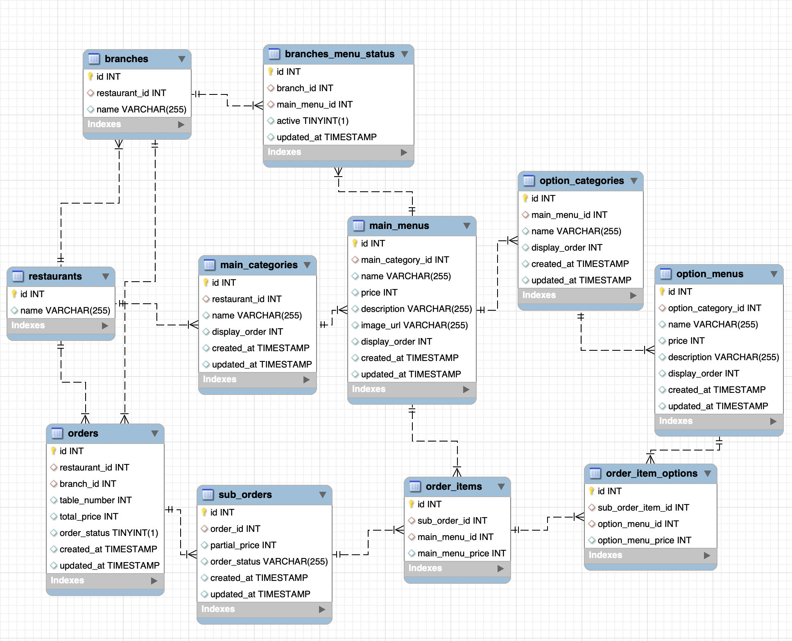

  

<H3 align="center"> <i> An Easy-to-use Scan & Order System for Restaruants  </i></H3>
 

## Table of Contents
1. [Description](#introduction)
2. [Features](#features)
3. [Design](#design)
4. [Tech Stack](#techstack)
    1. [Cloud](#cloud)
    2. [Backend](#backend)
    3. [Frontend](#frontend)
 

## Description 
"QR Mondrian" is a QR ordering system that boosts the dining experience and simplifies restaurant operations. Using QR code technology, customers can view menus and place orders directly from their phones.

For customers, this system removes the usual wait for a server to provide the menu or take an order. They just scan a QR code, view the menu on their phones, and place their orders right away, saving time and increasing convenience.

For restaurant owners, "QR Mondrian" brings a new level of efficiency. Owners can make real-time updates to menus and immediately stop orders when a dish runs out. This effective order management helps reduce errors and can also help decrease operational costs.

In conclusion, "QR Mondrian" stands as a time-saving and cost-effective solution, redefining the dining and ordering process for customers and restaurant owners alike.

### **User Flow**
<table>
    <tr>
        <td width="50%">
            
        </td>
	<td width="50%">
            
        </td>
    </tr>
    <tr>
        <td align="center">
            <a>User-side</a>
        </td>
    </tr>
</table>

 

## Features 

<table>
        <tbody>
		<tr>
			<td colspan=2>
				 
				<b>설문조사는 그만! 이제 스캔하세요.</b> 
				 
			</td>
		</tr>
		<tr>
            <td rowspan="1">

</td>
            <td width="33%"> 1. (간부) 식사시간 전 initData 생성용 정량 배식된 식판 스캔 </td>
        </tr>
        <tr>
            <td rowspan="1">

</td>
           <td>2. (병사) 식사 후 본인식별용 QR코드 스캔</td>
        </tr>
        <tr>
            <td rowspan="1">

</td>
           <td>3. (병사) 잔반 버리기 전 화면 속 규격에 식판 맞추고 스캔 </td>
        </tr>
   </tbody>
</table>

<table>
        <tbody>
		<tr>
			<td colspan=2>
				 
				<b>잔반도 줄이고 포상도 얻고, 일석이조의 챌린지</b> 
				 
			</td>
		</tr>
		<tr>
            <td rowspan="1">

</td>
            <td width="33%"> 챌린지 등록 및 삭제 </td>
        </tr>
        <tr>
            <td rowspan="1">

</td>
           <td>챌린지 정보 확인 (포상, 진행기간 등) </td>
        </tr>
        <tr>
            <td rowspan="1">

</td>
           <td>리더보드에서 챌린지 최신 순위 확인</td>
        </tr>
   </tbody>
</table>

<table>
        <tbody>
		<tr>
			<td colspan=2>
				 
				<b> 너 자신을 알라: 잔반 현황 및 식습관 파악하세요. </b> 
				 
			</td>
		</tr>
		<tr>
            <td rowspan="2">

</td>
            <td width="33%">끼니별 배식량 추천</td>
        </tr>
        <tr>
            <td>다양한 차트 + 애니메이션을 이용한 데이터 시각화 </td>
        </tr>
   </tbody>
</table>

<table>
        <tbody>
		<tr>
			<td colspan=2>
				 
				<b> ➕ 내 식판 (흑)역사 불러오기, 잔반앨범  </b> 
				 
			</td>
		</tr>
		<tr>
            <td rowspan="2">

</td>
            <td width="33%">스캔한 식판 사진 모두 조회 가능</td>
        </tr>
        <tr>
            <td>각 식판 사진별 잔반 클리어률 확인하여 밀스캔 알고리즘의 합리성 확인 </td>
        </tr>
   </tbody>
</table>

 

## Tech Stack 

### **Backend** 

|Node.js|
|:---:|
||

<table>
    <tr>
        <td width="100%">
            
        </td>
    </tr>
    <tr>
        <td align="center">
            <a href="https://dbdiagram.io/d/64ca9d2302bd1c4a5e2395dd">Database Structure</a>
        </td>
    </tr>
</table>

### Description of Tables

qr_mondrian_schema:\
&nbsp; - **restaurants**: contains basic information about different restaurants\
&nbsp; - **branches**: contains information about the various branches of each restaurant\
&nbsp; - **branches_menu_status**: contains the status of menus at different branches\
&nbsp; - **main_categories**: contains the main categories of menus in each restaurant\
&nbsp; - **main_menus**: contains the main menus under each category for the restaurants\
&nbsp; - **option_categories**: contains the various option categories under each main menu item\
&nbsp; - **option_menus**: contains the various option menus under each option category\
&nbsp; - **orders**: contains the details of customer orders at each branch\
&nbsp; - **sub_orders**: contains sub orders that make up a order\
&nbsp; - **order_items**: contains information about the items included in each sub order\
&nbsp; - **order_item_options**: containts the option items chosen for each order item

### List of Libraries in Use

|Library|Usage 
|:---:|:---:|
|[express](https://www.npmjs.com/package/express)| Application framework for building RESTful APIs  |
|[@aws-sdk/client-s3](https://www.npmjs.com/package/aws-sdk)| AWS sdk for accessing S3 buckets|
|[multer-s3](https://www.npmjs.com/package/multer)| Middleware to handle form-data when uploading images |
|[sequelize](https://www.npmjs.com/package/sequelize)| ORM tool to handle database transactions |
 

### **Frontend** 

|React|
|:---:|
||

<table>
    <tr>
        <td width="33%">
            
        </td>
        <td width="67%">
            
        </td>
    </tr>
    <tr>
        <td align="center">
            <a href="https://drive.google.com/file/d/1wtpR2PCCuPEl5Lq7ODCvMy5uxFw5hArr/view?usp=sharing">Customer Userflow</a>
        </td>
        <td align="center">
            <a href="https://drive.google.com/file/d/1PkmjmGlSpFRuUuk1BzAKiWPPfsHJhS0A/view?usp=sharing">Restaurant Userflow</a>
        </td>
    </tr>
</table>

### List of Libraries in Use

|Library|Usage 
|:---:|:---:|
|[@mui/material](https://www.npmjs.com/package/@mui/material)| Used to create UI elements like dropdown lists |
|[amazon-cognito-identity-js](https://www.npmjs.com/package/amazon-cognito-identity-js)| Connects to AWS Cognito for user login |
|[crypto-js](https://www.npmjs.com/package/crypto-js)| Used to encode and decode URLs for additional security |
|[jwt-decode](https://www.npmjs.com/package/jwt-decode)| Used for decode JWT tokens for handling user login |
|[react-beautiful-dnd](https://www.npmjs.com/package/react-beautiful-dnd)| Used to implement drag and drop functionality |
 
