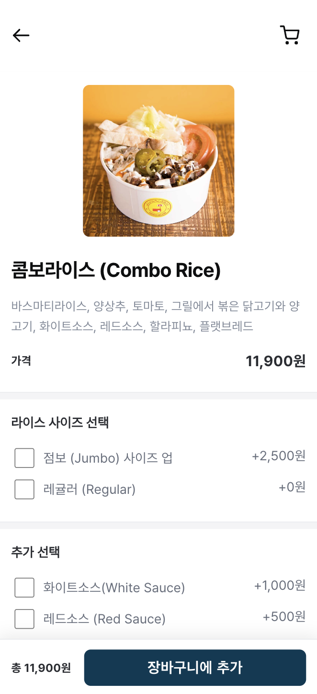

  

<H3 align="center"> <i> An Easy-to-use Scan & Order System for Restaruants  </i></H3>
 

## Table of Contents
1. [Description](#introduction)
2. [Features](#features)
3. [Design](#design)
4. [Tech Stack](#techstack)
    1. [Frontend](#frontend)
    2. [Backend](#backend)
    3. [Cloud](#cloud)
 

## Description 
"QR Mondrian" is a QR ordering system that boosts the dining experience and simplifies restaurant operations. Using QR code technology, customers can view menus and place orders directly from their phones.

For customers, this system removes the usual wait for a server to provide the menu or take an order. They just scan a QR code, view the menu on their phones, and place their orders right away, saving time and increasing convenience.

For restaurant owners, "QR Mondrian" brings a new level of efficiency. Owners can make real-time updates to menus and immediately stop orders when a dish runs out. This effective order management helps reduce errors and can also help decrease operational costs.

In conclusion, "QR Mondrian" stands as a time-saving and cost-effective solution, redefining the dining and ordering process for customers and restaurant owners alike.
 

## Features 

### Mobile 
<table>
    <tbody>
        <tr>
            <td>
                <b>Mobile Menu Page</b>
                 
            </td>
        </tr>
        <tr>
           <td rowspan="1" width="750px">
                

                    
                

            </td>
        </tr>
        <tr>
            <td> 
                On the Menu page, customers can easily check out menu offerings with a scroll bar for seamless navigation  
            </td>
        </tr>
    </tbody>
</table>

<table width="1200px">
    <tbody>
        <tr>
            <td>
                <b>Mobile Menu Details Page</b>
                 
            </td>
        </tr>
        <tr>
            <td rowspan="1" width="750px">
               

                    
                

            </td>
        </tr>
        <tr>
            <td> 
                On the Menu Details page, customers can view and select option items, select the quantity for each menu item, and add the menu item to the cart.
            </td>
        </tr>
    </tbody>
</table>

<table>
    <tbody>
        <tr>
            <td>
                <b>Mobile Cart Page</b>
                 
            </td>
        </tr>
        <tr>
            <td rowspan="1" width="750px">
                

                    
                

            </td>
        </tr>
        <tr>
            <td> 
                On the Cart Page, customers can edit menu item details, modify quantities, delete items, review past orders, and finally submit their current order.
            </td>
        </tr>
    </tbody>
</table>
 

## Design 

### Design

<table>
    <tr>
        <td>
            
        </td>
        <td>
            
        </td>
    </tr>
    <tr>
        <td align="center">
            <a href="https://github.com/SPQR-Project/frontend/blob/main/assets/readme/design/initial_wireframe.png">Initial Wireframe</a>
        </td>
        <td align="center">
            <a href="https://github.com/SPQR-Project/frontend/blob/main/assets/readme/design/final_mockup.png">Final Mockup</a>
        </td>
    </tr>
  <tr>
        <td>
            
        </td>
        <td>
            
        </td>
    </tr>
    <tr>
        <td align="center">
            <a href="https://github.com/SPQR-Project/frontend/blob/main/assets/readme/design/color_style.png">Color Style Guide</a>
        </td>
        <td align="center">
            <a href="https://github.com/SPQR-Project/frontend/blob/main/assets/readme/design/text_style.png">Text Style Guide</a>
        </td>
    </tr>
</table>

### Implementation of Design
#### Mobile
<table>
    <tbody>
        <tr>
            <td width = "250px">
                
            </td>
            <td width = "250px">
                
            </td>
            <td width = "250px">
                
            </td>
        </tr>
        <tr>
            <td align = "center">Mobile Menu Page</td>
            <td align = "center">Mobile Menu Details Page</td>
            <td align = "center"> Mobile Cart Page</td>
        </tr>
    </tbody>
</table>

#### Web
<table>
    <tbody>
        <tr>
            <td colspan="2" align="center">
                
            </td>
        </tr>
        <tr>
            <td colspan="2" align="center">Web Login Page</td>
        </tr>
        <tr>
            <td>
                
            </td>
            <td>
                
            </td>
        </tr>
        <tr>
            <td align="center">Web Menu Page(HQ)</td>
            <td align="center">Web Menu Add Page(HQ)</td>
        </tr>
        <tr>
            <td>
                
            </td>
            <td>
                
            </td>
        </tr>
        <tr>
            <td align="center">Web Menu Edit Page(HQ)</td>
            <td align="center">Web Menu Display Order Edit Page(HQ)</td>
        </tr>
        <tr>
            <td>
                
            </td>
            <td>
                
            </td>
        </tr>
        <tr>
            <td align="center">Web Menu Page(Branch)</td>
            <td align="center">Web Order Page(Branch)</td>
        </tr>
    </tbody>
</table>
 

## Tech Stack 

### **Frontend** 

|React|
|:---:|
||

<table>
    <tr>
        <td width="33%">
            
        </td>
        <td width="67%">
            
        </td>
    </tr>
    <tr>
        <td align="center">
            <a href="https://drive.google.com/file/d/1wtpR2PCCuPEl5Lq7ODCvMy5uxFw5hArr/view?usp=sharing">Customer Userflow</a>
        </td>
        <td align="center">
            <a href="https://drive.google.com/file/d/1PkmjmGlSpFRuUuk1BzAKiWPPfsHJhS0A/view?usp=sharing">Restaurant Userflow</a>
        </td>
    </tr>
</table>

### List of Libraries in Use

|Library|Usage 
|:---:|:---:|
|[@mui/material](https://www.npmjs.com/package/@mui/material)| Used to create UI elements like dropdown lists |
|[amazon-cognito-identity-js](https://www.npmjs.com/package/amazon-cognito-identity-js)| Connects to AWS Cognito for user login |
|[crypto-js](https://www.npmjs.com/package/crypto-js)| Used to encode and decode URLs for additional security |
|[jwt-decode](https://www.npmjs.com/package/jwt-decode)| Used for decode JWT tokens for handling user login |
|[react-beautiful-dnd](https://www.npmjs.com/package/react-beautiful-dnd)| Used to implement drag and drop functionality |
 

### **Backend** 

|Node.js|
|:---:|
||

<table>
    <tr>
        <td>
            
        </td>
    </tr>
    <tr>
        <td align="center">
            <a href="https://dbdiagram.io/d/64ca9d2302bd1c4a5e2395dd">Database Structure</a>
        </td>
    </tr>
</table>

### Description of Tables

qr_mondrian_schema:\
&nbsp; - **restaurants**: basic information about different restaurants\
&nbsp; - **branches**: information about the various branches of each restaurant\
&nbsp; - **branches_menu_status**: the status of menus at different branches\
&nbsp; - **main_categories**: the main categories of menus in each restaurant\
&nbsp; - **main_menus**: the main menus under each category for the restaurants\
&nbsp; - **option_categories**: the various option categories under each main menu item\
&nbsp; - **option_menus**: the various option menus under each option category\
&nbsp; - **orders**: the details of customer orders at each branch\
&nbsp; - **sub_orders**: sub orders that make up a order\
&nbsp; - **order_items**: information about the items included in each sub order\
&nbsp; - **order_item_options**: the option items chosen for each order item

### APIs

| Type | View | Method | Feature | URL |
| ---- |  ---- | ---- | ---- | ---- |
| Universal | Web/Mobile Menu View| GET | [Get all menu](https://github.com/SPQR-Project/backend/wiki/Get-all-menu) | `/menu/:restaurant_id/:branch_id/:table_number/`|✅|
| Universal | Web/Mobile Menu Details View | GET | [Get menu details](https://github.com/SPQR-Project/backend/wiki/Get-menu-details) | `/menu/:restaurant_id/:branch_id/:table_number/:menu_id/`|✅|
| Mobile | Cart View | GET | [Get past orders](https://github.com/SPQR-Project/backend/wiki/Get-past-orders) | `/cart_m/:restaurant_id/:branch_id/:table_number/`| ✅|
| Mobile | Cart View | POST | [Post current order](https://github.com/SPQR-Project/backend/wiki/Post-current-order) | `/cart_m/:restaurant_id/:branch_id/:table_number/`|✅|
| Web | Order View | GET | [Get all orders](https://github.com/SPQR-Project/backend/wiki/Get-all-orders) | `/order_w/:restaurant_id/:branch_id/`|✅|
| Web | Order View | PUT | [Update order status](https://github.com/SPQR-Project/backend/wiki/Update-order-status) | `/order_w/:restaurant_id/:branch_id/`|✅|
| Web | Menu View | PUT | [Update menu status](https://github.com/SPQR-Project/backend/wiki/Update-menu-status) | `/menu_w/:restaurant_id/:branch_id/status`|✅|
| Web | Menu View | DELETE | [Delete menu or category](https://github.com/SPQR-Project/backend/wiki/Delete-menu-or-category) | `/menu_w/:restaurant_id/:branch_id/request_type/:request_id`|✅|
| Web | Menu Display Order Edit View | POST | [Create new category](https://github.com/SPQR-Project/backend/wiki/Create-new-category) | `/menu_w/:restaurant_id/:branch_id/category`|✅|
| Web | Menu Display Order Edit View | PUT | [Edit display order](https://github.com/SPQR-Project/backend/wiki/Edit-display-order) |  `/menu_w/:restaurant_id/:branch_id/display_order`|✅|
| Web | Menu Add View | POST | [Create new menu](https://github.com/SPQR-Project/backend/wiki/Create-new-menu) | `/menu_w/:restaurant_id/:branch_id/menu`|✅|
| Web | Menu Edit View | PUT | [Edit menu](https://github.com/SPQR-Project/backend/wiki/Edit-Menu) |  `/menu_w/:restaurant_id/:branch_id/:menu_id/menu`|✅|

### List of Libraries in Use

|Library|Usage 
|:---:|:---:|
|[express](https://www.npmjs.com/package/express)| Application framework for building RESTful APIs  |
|[@aws-sdk/client-s3](https://www.npmjs.com/package/aws-sdk)| AWS sdk for accessing S3 buckets|
|[multer-s3](https://www.npmjs.com/package/multer)| Middleware to handle form-data when uploading images |
|[sequelize](https://www.npmjs.com/package/sequelize)| ORM tool to handle database transactions |
 

### **Cloud** 

|AWS|
|:---:|
||

<table>
    <tr>
        <td>
            
        </td>
    </tr>
    <tr>
        <td align="center">
            <a href="https://drive.google.com/file/d/1kV82iaBPt1sfN_dtzdvg5dQ6-JNbQNyn/view?usp=sharing">System Architecture</a>
        </td>
    </tr>
</table>

### List of Services in Use

|Service|Usage| 
|:---:|:---:|
|[Amazon Cognito](https://aws.amazon.com/cognito/)| CIAM to handle user login |
|[Amazon Route53](https://aws.amazon.com/route53/)| DNS service to map the frontend EC2 server to a custom URL |
|[Amazon EC2](https://aws.amazon.com/ec2/)| Virtual server used alongside PM2 to host frontend and backend |
|[Amazon RDS](https://aws.amazon.com/rds/)| Databse service(MySQL) to store data |
|[Amazon S3](https://aws.amazon.com/s3/)| Storage service for images |
